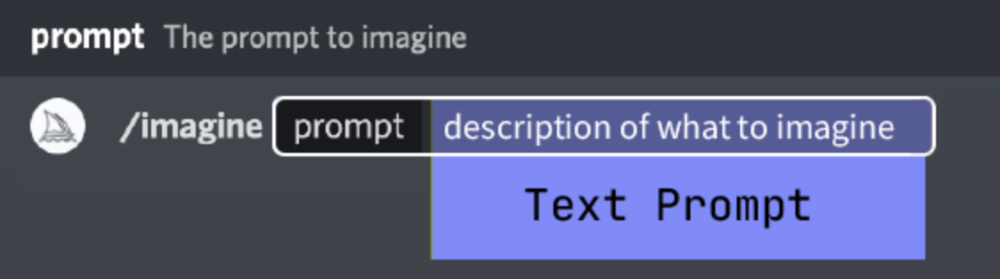
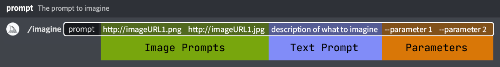

# Midjourney

## 1. 安装
正常玩法：准备邮箱、visa|master信用卡，还有魔法梯子，因为`discord`大陆无法直接访问。如果魔法方面没有资源，可通过下载[Watt Toolkit](https://steampp.net/) 因其为开源项目，也可以在github、gitee等找到，安装好软件后，在左侧第二个按钮`网络加速`中勾选`discord语音聊天`。等待安装完毕可以在客户端中使用`discord`。
进入`discord`后，先使用邮箱注册，填入手机号码。创建账号后，点击discord左侧“+”按钮创建自己的服务器，也可以加入到别人的服务器。  
在发现中搜索`midjourney`，点击`Midjourney Bot`加入到自己的服务器。

## 2. 开始使用
[midjourney官方文档](https://docs.midjourney.com/docs/quick-start)  
使用一款软件，建议先浏览完官方的文档。现在B站、抖音 都有非常多的相关教程视频。通过文档或视频一步步跟着做，有助于对命令和参数的理解
### 基础Prompt
在 Midjourney 的官方介绍文档里，介绍了最简单的 Prompt 结构是这样的：

如果用图片提示词，就是俗称`垫图`就是下面👇的样子

> 注意：图片提示词可以是两张
#### 参数

| 参数 | 含义 | 例子 | 
| --- | --- | --- |
| --v | 版本 | `--v 6` 参数4、5.0、5.1、5.2、6，5系列有较多惊喜 |
| --ar | 尺寸比例 | 默认`1:1`，比例自定义，必须是正整数 |
| --no | 否定 | 不要出现的东西，如：`--no egg` |
| --c | 风格随机性 | 默认0，在第一次出图想要不同效果的时候可以使用 `--c 100` |
| --s | 控制生成图片的风格化程度 | 默认100，值越低会更符合 prompt 的描述，数值越高艺术性就会越强，但跟 prompt 关联性就会比较弱 |
| --niji | 版本 | 「niji」是日语「にじ」，意思是「彩虹」 或者 「2D」。专门用于动漫`--niji 4` |
| --seed | 种子 | 在版本不变的情况下，seed相同，出的图就有很高的相似度 |
| --cref | 风格、人脸一致性 | 换脸、做绘本等需要一致性的场景，保证脸一样的情况下可以换衣服等，但需要是MJ生成的图 |

## 3. prompt提示词
首先 Midjourney 基本上是不懂语法的，所以即使你语法错了，只要词对了，也能生成图片。

另外，不懂语法也导致了另一个问题：prompt 不是越长越好（超过80个单词，MJ也不认识）。什么从句或长句，它根本就不懂，还不如把指令用逗号隔开，一个个输入。以下是官方推荐的语法建议：

+ 使用形容词+名词的词序来替换介词短语。
    + hair flowing in the wind 应该改为 `flowing hair`
    + a carrot for a nose 应该改为 `carrot nose`
+ 使用非常具体的动词来替换介词短语。
    + a girl with a flashlight 应该改为 `a girl using a flashlight`
    + a girl with a big smile on her face 应该改为 `smiling girl`

最后， Midjourney 是不会区分大小写的。
### 公式
| 目的	| Prompt | 解释 |  
| --- | --- | --- |
| 画面类型是什么？	| light watercolor | 类型是水彩 |
| 主体是什么？	| a sleeping cat | 主体是猫 |
| 环境是怎样的？| in door | 室内，猫窝等，大部分时间可以让 AI 自由发挥 |
| 构图是怎样的？| null | 构图不重要，让 AI 自由发挥 |
| 光影是怎样的？| Natural light | 在真实照片、动画电影场景、写真、人物特写等需要使用，普通简约插画不太用得上。 |
| 背景是什么？	| white background | 背景是白色 |
| 是什么风格？	| Studio Ghibli | 风格是吉卜力风格 |

### 关键词
#### 风格
| prompt | 含义 | 
| --- | --- |
| Pixar | 皮克斯 | 
| Bauhaus | 包豪斯 |
| futuristic | 未来主义 |
| Ghibli | 吉卜力工作室 |
| kineticart| 动态艺术 |
| Minimalist| 极简主义 |
| magic realism | 魔幻主义 |
| instagram model | ins模特 |
| photorealistic | 照片写实风格 |
| national geography | 国家地理 |
| American comic style | 美国漫画风 |
| trending on artstation | 流行艺术 |

#### 艺术家
| prompt | 含义 | 
| --- | --- |
| ShinkaiMakoto | 新海诚 |
| Hayao Miyazaki | 宫崎骏 |
| akira toriyama | 乌山明 |
| Picasso | 毕加索 |
| adrian tomine | 艾德里安·托米尼 |
| berniefuchs | 伯尼·福克斯 |

#### 修饰词
| prompt | 含义 | 
| --- | --- |
| Award-winning photo | 获奖图片 |
| masterpiece | 代表作 |
| cinematic atmosphere | 电影氛围 |
| hyper-realistic | 超现实 | 
| aesthetic | 审美学 | 

#### 风格｜绘画技术
| prompt | 含义 | 
| --- | --- |
| oil painting | 油画 | 
| watercolor | 水彩 | 
| acrylic painting | 丙烯画 | 
| digital painting | 数码绘画 | 
| charcoal drawing | 炭笔画 | 
| pencil drawing | 铅笔画 | 
| ink drawing | 墨水画 | 
| pastel drawing | 粉彩画 | 
| acrylic painting | 丙烯画 | 
| Vetor | 矢量 | 
| acrylic painting | 丙烯画 |

| prompt | 含义 | 
| --- | --- |
| akira toriyama | 乌山明 | 
| Picasso | 毕加索 | 
| adrian tomine| 艾德里安·托米尼 | 
| berniefuchs| 伯尼·福克斯 | 

## 4. 参考

- [Midjourney](https://docs.midjourney.com/)
- [midlibrary艺术家](https://midlibrary.io/)